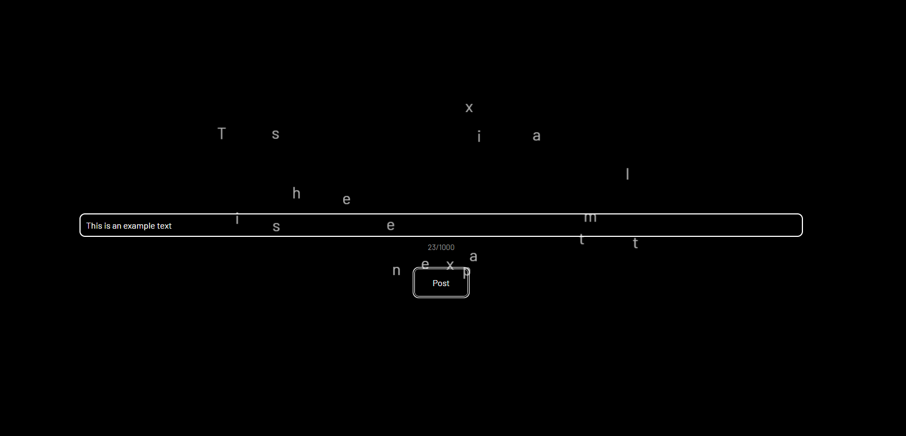

# No Destination

This project, crafted with [Create React App](https://github.com/facebook/create-react-app), serves as a hands-on exercise to delve into JavaScript and CSS animations. The application allows users to type in messages which, upon submission, gradually fade away and scatter across the screen. Symbolically, it provides an avenue to release emotions or thoughts, offering users a space to express themselves without the fear of someone else seeing or judging their words. It's the perfect tool for those moments when you just need to let out what you feel, knowing it will vanish in an instant.

## Available Scripts

Within the project directory, you can run:

- `npm start`: Launches the app in development mode. Open [http://localhost:3000](http://localhost:3000) to view it in the browser.

## More Information

- [Create React App Documentation](https://facebook.github.io/create-react-app/docs/getting-started)
- [React Documentation](https://reactjs.org/)
- [Deployment](https://facebook.github.io/create-react-app/docs/deployment)
- [Optimization and Analysis](https://facebook.github.io/create-react-app/docs/analyzing-the-bundle-size)
- [Advanced Configuration](https://facebook.github.io/create-react-app/docs/advanced-configuration)

